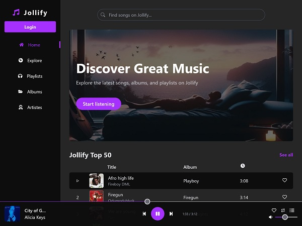
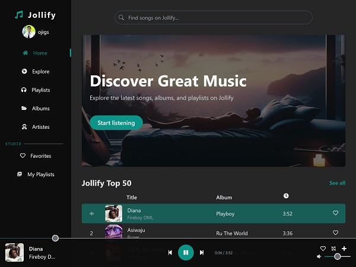

# Jollify

Jollify is a full-stack MERN (MongoDB, Express.js, React, Node.js) music streaming application. This project aims to create an immersive music listening experience with features like song streaming, playlist creation, artiste exploration, and more. <a href="https://jollify.vercel.app" target="_blank">See it here</a>



## Features
- **Song Streaming**: Enjoy a seamless streaming experience with the ability to listen to your favorite songs anytime, anywhere.
- **Playlist Creation**: Create and manage personal playlists by curating a collection of your preferred songs. Organize your music in a way that suits your mood or activity.
- **Artiste Exploration**: Discover new music by exploring artiste profiles. Gain insights into artiste backgrounds, view cover images, and explore their discography to find hidden gems.
- **Album Details**: Access detailed information about albums, including tracklists and cover art. Dive deep into the world of your favorite albums and explore the richness of each musical collection.
- **Secure Authentication**: Jollify prioritizes user security by providing a secure authentication system. Users can create accounts, log in securely, and enjoy a personalized music experience.
- **Third-Party Authentication**: Choose from a variety of authentication options, including Google, Facebook, and Twitter. The app allows users the flexibility to authenticate using their preferred third-party providers.
- **Account Linking**: Users are not limited to a single authentication method. If the email address is the same, users can seamlessly switch between different authentication providers without losing their data.
- **Interactive Comments**: Engage with the music community by adding comments to your favorite songs. Share your thoughts, recommendations, or connect with other users who share similar musical interests.

## Technologies Used
- React
- Node
- Express
- MongoDB
- Mongoose
- Redux
- RTK Query
- JSON Web Tokens
- Passport
- Tailwind CSS
- Cloudinary
- AdminJS
- ReCAPTCHA
- AWS S3

## Getting Started
Follow these steps to set up and run the Jollify Music App locally on your machine.

### Prequisite
Node and npm installed

### Clone the Repository
```bash 
git clone https://github.com/ojigs/jollify.git

cd jollify
```

### Install Dependencies
#### Frontend
```bash
cd client

npm install
```
#### Backend 
```bash
cd server

npm install
```

### Environment Variables
Create a `.env` file in the config subdirectory of the server directory and set the following variables
```env 
PORT = 4000

DB_STRING = your_mongodb_connection_string

JWT_SECRET = your_JWT_secret

CLOUD_NAME = your_cloudinary_cloudname

API_KEY = your_cloudinary_api_key

API_SECRET = your_cloudinary_api_secret

GOOGLE_CLIENT_ID = your_google_client_id

GOOGLE_CLIENT_SECRET = your_google_client_secret

TWITTER_CONSUMER_KEY = your_twitter_consumer_key

TWITTER_CONSUMER_SECRET = your_twitter_consumer_secret

FACEBOOK_APP_ID = your_facebook_app_id

FACEBOOK_APP_SECRET = your_facebook_app_secret

RECAPTCHA_SECRET_KEY = your_recaptcha_secret_key
```

Create a `.env` file in the client directory and set the following variables
```env
VITE_JOLLIFY_KEY = your_aws_s3_bucket_public_url

VITE_RECAPTCHA_SITE_KEY = your_recaptcha_key

VITE_JOLLIFY_BACKEND = your_server_locahost (e.g http://localhost:4000)
```

### Run the Application
#### Frontend  
```bash 
cd client

npm run dev
```
#### Backend
```bash 
cd server

npm run dev
```

Visit `http://localhost:5173` in your browser to access Jollify.

## Usage
### User Authentication
- Register a new account on the app
- Login with your credentials
### Explore Songs
- Browse the Explore page to discover a variety of songs.
- Play songs directly from the Explore page.
- Access detailed information about songs
### Playlists
- Create your own playlists
- Add songs to playlists.
- Play entire playlists.
### Albums and Artistes
- Explore albums and artistes to find your favorite music.
- Play songs from specific albums and artistes
### Player Controls
- Use the playbar to control playback.
- Adjust volume and seek through songs.

## Deployment
- Jollify is deployed on Vercel
- Access it at https://jollify.vercel.app

## Contributing
Contributions are welcome! Here's how you can contribute to the Jollify project:

1. **Fork the Repository**: Click the "Fork" button on the top right corner of this repository.
2. **Clone Your Fork**: Open a terminal and run the following command to clone your fork to your local machine.

   ```bash
   git clone https://github.com/your-username/jollify.git
   ```
4. **Create a New Branch**: Move into the project's directory and create a new branch for your contribution.

   ```bash
   cd jollify
   
   git checkout -b feature/your-feature-name
   ```
6. **Make Changes**: Make your desired changes to the codebase.
7. **Commit Changes**: After making your changes, commit them with a descriptive commit message.

   ```bash
   git add .
   
   git commit -m "Add your descriptive message here"
   ```
9. **Push Changes**: Push your changes to your forked repository.

   ```bash
   git push origin feature/your-feature-name
   ```
11. **Create a Pull Request**: Visit your fork on GitHub and create a new pull request from your branch to the main branch of the original repository.
12. **Discuss and Improve**: Participate in discussions and address feedback if needed. Work with the maintainers to get your changes merged.

## Snapshots




## Author
Emmanuel Ojighoro <a href="https://www.twitter.com/emmaojigs" target="_blank">@emmaojigs</a> 

https://ojigs.netlify.app

## License
Jollify is licensed under the ISC License. See [LICENSE](LICENSE) file for more details.
